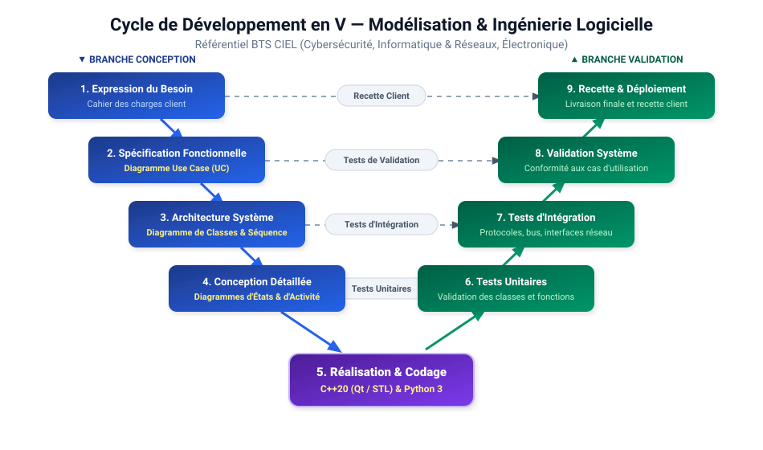

# 📚 Module 01 — Démarche de Conception & Rôle de l'UML en BTS CIEL

---

## 1. Pourquoi concevoir avant de coder ?

Dans les projets industriels et les épreuves professionnelles du **BTS CIEL** (épreuve **E5** : Conception logicielle/matérielle, et épreuve **E6** : Projet de fin d'études), une approche sans phase de modélisation mène inévitablement à des bugs, des régressions et une architecture impossible à maintenir.

> [!IMPORTANT]
> **UML (Unified Modeling Language)** est un **langage graphique standardisé** (OMG) permettant de **spécifier**, **visualiser** et **documenter** les architectures logicielles et matérielles.

---

## 2. Le Cycle de Développement en V



- **Branche descendante (Conception) :** On part du besoin client (Use Case) pour concevoir la structure logicielle (Classes) et les échanges dynamiques (Séquence).
- **Bas du V (Réalisation) :** Codage propre en **C++** (orienté objet, Qt, embarqué) et **Python**.
- **Branche montante (Validation) :** Tests unitaires des classes, tests d'intégration des protocoles, et recette conforme aux cas d'utilisation.

---

## 3. Les 3 Diagrammes Fondamentaux en BTS CIEL

La norme UML propose de nombreux diagrammes, mais dans la filière **BTS CIEL**, trois diagrammes constituent 90% du besoin industriel :

| Diagramme | Type | Question à laquelle il répond | Utilité en Projet CIEL |
| :--- | :---: | :--- | :--- |
| **Cas d'Utilisation (UC)** | Fonctionnel | *Quelles fonctionnalités le système offre-t-il aux utilisateurs et systèmes tiers ?* | Expression du besoin et dossier de spécification (E5/E6). |
| **Classes** | Statique | *Comment sont découpées et reliées les entités logicielles (attributs, méthodes, héritage, associations) ?* | Pierre angulaire de la programmation orientée objet en C++ et Python. |
| **Séquence** | Dynamique | *Comment les objets et services réseau dialoguent-ils chronologiquement au fil du temps ?* | Protocoles de communication (MQTT, HTTP REST, UART, SPI, Sockets). |

---

## 4. Cohérence entre les Diagrammes

```
+---------------------------+
| Cas d'Utilisation (UC)    |  <-- Définit les fonctionnalités attendues
+---------------------------+
              │
              ▼
+---------------------------+
| Diagramme de Séquence     |  <-- Met en scène les objets réalisant chaque cas
+---------------------------+
              │
              ▼
+---------------------------+
| Diagramme de Classes      |  <-- Structure le code source (C++ / Python)
+---------------------------+
```
