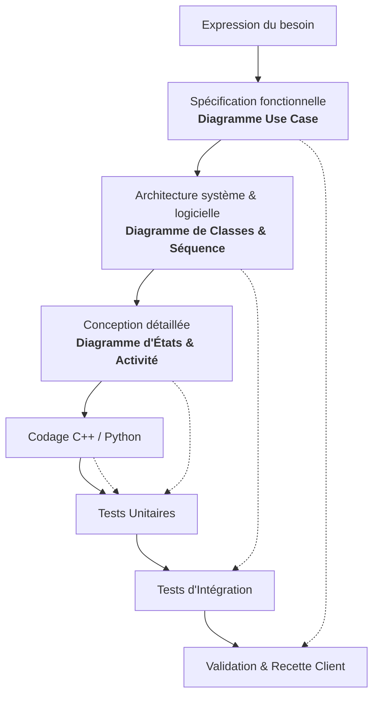
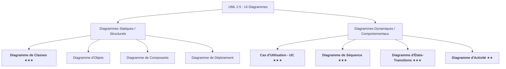

# 📚 Module 01 — Démarche de Conception & Rôle de l'UML en BTS CIEL

---

## 1. Pourquoi concevoir avant de coder ?

Dans le cadre des projets industriels et des épreuves professionnelles du **BTS CIEL** (épreuve **E5** : Conception et développement logiciel / matériel, et épreuve **E6** : Projet de fin d'études), une erreur récurrente consiste à se lancer immédiatement dans l'écriture du code sans phase préalable d'analyse et de modélisation.

Cette approche empirique (« code & fix ») entraîne inévitablement :
- Une incompréhension des besoins réels de l'utilisateur.
- Une architecture logicielle rigide, non réutilisable et difficilement testable.
- Des régressions constantes lors de l'ajout de nouvelles fonctionnalités.
- Une documentation inexistante rendant impossible le travail en équipe.

> [!IMPORTANT]
> **UML (Unified Modeling Language)** n'est pas un langage de programmation, mais un **langage graphique standardisé** (normalisé par l'OMG - *Object Management Group*) permettant de **spécifier**, **visualiser**, **concevoir** et **documenter** les architectures logicielles et matérielles.

---

## 2. Les Cycles de Vie de Projet

### A. Le Cycle en V (Traditionnel & Industriel)
Le cycle en V est une référence majeure dans l'industrie (défense, automobile, ferroviaire, médical, réseaux d'infrastructure) :

### B. Les Démarches Agiles (Scrum, Kanban)
Dans les environnements modernes, les développements s'effectuent par itérations courtes (sprints de 2 à 3 semaines). L'UML y conserve un rôle fondamental :
- En début de sprint : modélisation rapide sur tableau blanc ou en Mermaid/PlantUML pour aligner l'équipe sur la structure des classes et les contrats d'API.
- Pendant la réalisation : maintien d'un diagramme de classes et de séquence à jour pour documenter le dépôt Git.

---

## 3. Les Deux Grandes Familles de Diagrammes UML

La norme UML 2.5 définit 14 types de diagrammes classés en deux catégories :

---

## 4. Les 5 Diagrammes Incontournables en BTS CIEL

| Diagramme | Catégorie | Question à laquelle il répond | Importance BTS CIEL |
| :--- | :---: | :--- | :---: |
| **Cas d'Utilisation (UC)** | Dynamique / Besoins | *Quelles fonctionnalités le système offre-t-il aux utilisateurs externes ?* | Épreuve E5 / Dossier E6 |
| **Classes** | Statique | *Comment sont découpées et reliées les entités logicielles (classes, héritage, collections) ?* | Épreuve E5 / Épreuve E6 |
| **Séquence** | Dynamique | *Comment les objets s'échangent-ils des messages chronologiques sur le réseau ou en mémoire ?* | Protocoles & API |
| **États-Transitions** | Dynamique | *Comment un sous-système réactif (modem, capteur, automate) change-t-il d'état selon les événements ?* | Embarqué & Protocoles |
| **Activité** | Dynamique | *Quel est le cheminement logique, décisionnel ou parallèle d'un algorithme ?* | Traitements & Algorithmes |

---

## 5. Synthèse & Bonnes Pratiques pour les Étudiants

1. **Un diagramme n'est pas une fin en soi :** Il doit être lisible, sobre et répondre à un problème précis d'ingénierie.
2. **Cohérence inter-diagrammes :**
   - Chaque cas d'utilisation important dans le diagramme UC se traduit par un scénario représenté par un **diagramme de séquence**.
   - Chaque participant du diagramme de séquence doit correspondre à une **classe** existant dans le **diagramme de classes**.
   - Un objet ayant un cycle de vie complexe dans le diagramme de classes mérite son **diagramme d'états-transitions**.
