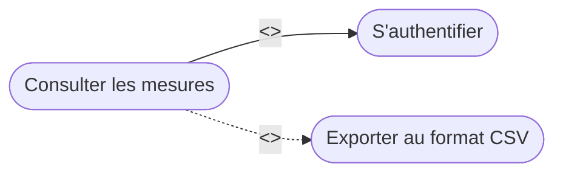

# 📚 Module 02 — Le Diagramme des Cas d'Utilisation (Use Case Diagram)

---

## 1. Définition & Objectif

Le diagramme des cas d'utilisation modélise les **besoins fonctionnels** du système du point de vue de ses utilisateurs.
Il permet de délimiter le périmètre du projet (*scope*) : **ce que fait le système, et non la façon dont il est programmé**.

---

## 2. Les Composants d'un Diagramme Use Case

### A. Le Système & sa Frontière
Le système est représenté par un rectangle portant son nom. Les cas d'utilisation sont placés **à l'intérieur** du rectangle. Les acteurs se situent **à l'extérieur**.

### B. Les Acteurs
Un acteur est une entité externe qui interagit avec le système :
- **Acteur principal (primaire) :** Déclenche l'interaction pour accomplir un objectif direct (ex : *Opérateur de supervision*, *Utilisateur mobile*).
- **Acteur secondaire :** Sollicité par le système pour rendre un service (ex : *Serveur d'authentification LDAP*, *Horloge temps réel RTC*, *Base de données distante*).
- **Acteur matériel / système :** Composant externe non humain (ex : *Station météo externe*, *Broker MQTT distant*).

### C. Les Cas d'Utilisation (Use Cases)
Représentés par des ellipses, ils décrivent une action complète produisant une valeur pour l'acteur.
*Règle d'or :* Le libellé doit commencer par un **verbe à l'infinitif** (ex: *« Configurer les alertes »*, *« Télécharger l'historique »*).

---

## 3. Les Relations entre Cas d'Utilisation



### A. L'Inclusion : `<<include>>`
- **Définition :** Le cas source fait **systématiquement et obligatoirement** appel au cas inclus.
- **Direction de la flèche :** Du cas source vers le cas inclus (`A ..> B : <<include>>`).
- **Exemple :** Pour *« Modifier les paramètres réseau »*, il faut obligatoirement *« S'authentifier »*.

### B. L'Extension : `<<extend>>`
- **Définition :** Le cas étendu s'exécute **optionnellement** selon une condition ou un événement particulier (point d'extension).
- **Direction de la flèche :** Du cas optionnel vers le cas de base (`B ..> A : <<extend>>`).
- **Exemple :** Lors de *« Visualiser les mesures »*, l'utilisateur peut optionnellement *« Exporter au format PDF »*.

### C. La Généralisation (Héritage)
- Entre acteurs : Un *Administrateur* peut réaliser tout ce que fait un *Technicien*, plus des actions réservées.
- Entre cas d'utilisation : *« Payer par carte bancaire »* et *« Payer sans contact »* héritent de *« Régler la transaction »*.

---

## 4. Exemple Concret : Station Météo Communicante (BTS CIEL)

```mermaid
flowchart LR
    subgraph Station["Système : Station Météo Connectée"]
        UC1(["Consulter les températures en direct"])
        UC2(["Paramétrer le seuil d'alerte"])
        UC3(["S'authentifier"])
        UC4(["Publier les mesures vers le Cloud"])
        UC5(["Filtrer l'historique par date"])
    end

    Tech["Technicien de Maintenance"]
    User["Utilisateur Final"]
    Broker["Serveur MQTT Cloud"]
    RTC["Horloge Interne RTC"]

    User --> UC1
    Tech --> UC2
    Tech --|> User
    
    UC2 -.->|"<<include>>"| UC3
    UC5 -.->|"<<extend>>"| UC1
    
    RTC --> UC4
    UC4 --> Broker
```

---

## 5. Description Textuelle d'un Cas d'Utilisation

En BTS CIEL, le diagramme doit impérativement être accompagné de fiches de description textuelle pour les cas majeurs.

### Modèle de Fiche Descriptive :
| Rubrique | Contenu |
| :--- | :--- |
| **Titre du cas :** | Paramétrer le seuil d'alerte |
| **Objectif :** | Permettre à un technicien habilité de redéfinir la température critique de déclenchement d'alarme |
| **Acteur principal :** | Technicien de Maintenance |
| **Acteurs secondaires :**| Horloge RTC, Mémoire Flash EEPROM |
| **Préconditions :** | La station est alimentée, la liaison de configuration (USB ou Web) est active |
| **Scénario nominal :** | 1. Le technicien sélectionne le menu « Configuration ».<br>2. Le système demande l'authentification (`<<include>>`).<br>3. Le technicien saisit son code PIN.<br>4. Le système valide le code PIN et affiche les seuils actuels.<br>5. Le technicien saisit le nouveau seuil (ex: 35.0 °C).<br>6. Le système contrôle la cohérence de la saisie (valeur entre -40 et +85 °C).<br>7. Le système enregistre le nouveau seuil en mémoire non-volatile.<br>8. Le système confirme l'enregistrement au technicien. |
| **Scénarios d'exception :** | **3a. Code PIN invalide :** Le système affiche un message d'erreur et bloque après 3 tentatives.<br>**6a. Valeur hors limites :** Le système invite à saisir une valeur correcte sans modifier l'ancienne. |
| **Postconditions :** | Le nouveau seuil est actif et persistant après redémarrage. |
