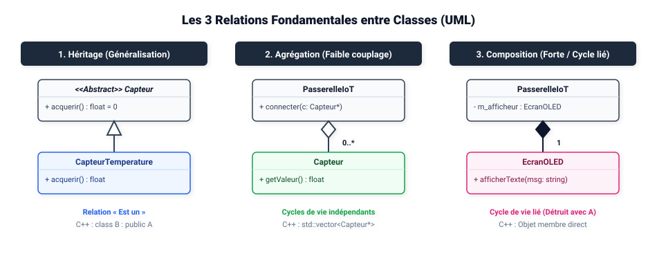
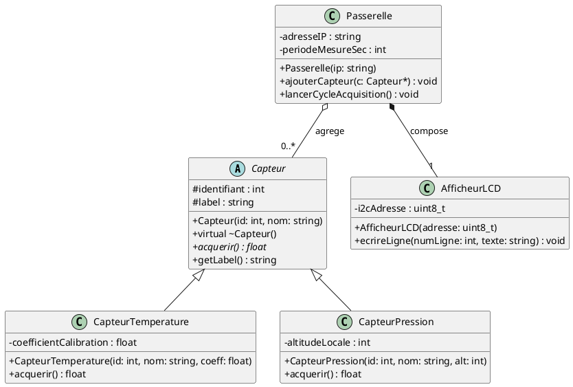

# 📚 Module 03 — Le Diagramme de Classes

---

## 1. Rôle et Importance

Le diagramme de classes est le diagramme **le plus important** de l'UML pour les développeurs logiciels et systèmes embarqués (BTS CIEL IR/ER). Il modélise la **structure statique** du système en représentant les classes, leurs attributs, leurs méthodes et leurs relations mutuelles.

---

## 2. Anatomie d'une Classe UML

Une classe est représentée par un rectangle divisé en trois compartiments :

```
+-------------------------------------------------------------+
| NomDeLaClasse                                               |  <- Nom (en CamelCase)
+-------------------------------------------------------------+
| - identifiant : int                                         |
| # nomCapteur : string                                       |  <- Attributs
| + valeur : float = 0.0                                      |
+-------------------------------------------------------------+
| + getValeur() : float                                       |  <- Méthodes / Opérations
| + setSeuil(seuilMax: float) : bool                          |
| + {abstract} acquerir() : void                              |
+-------------------------------------------------------------+
```

### Notation des Membres :
- **Attribut :** `visibilité nom : type [multiplicité] = valeurInitiale`
- **Méthode :** `visibilité nom(param1: type1, param2: type2) : typeRetour`

### Visibilités normalisées :
- `+` : **Public**
- `-` : **Privé** (encapsulation)
- `#` : **Protégé** (accessible aux classes dérivées)
- `~` : **Package**

---

## 3. Les Relations entre Classes



### A. L'Association Simple & Navigabilité
Une association relie deux classes qui communiquent.
- Une flèche indique la **navigabilité** : si `Passerelle --> Modem`, alors la Passerelle possède une référence vers le Modem, mais le Modem ignore qui l'appelle.
- Les **multiplicités** précisent combien d'instances participent à la relation :
  - `1` : Un et un seul.
  - `0..1` : Zéro ou un (ex: un pointeur pouvant être `nullptr`).
  - `*` ou `0..*` : De zéro à l'infini (stocké dans un tableau dynamique ou une liste).
  - `1..*` : Au moins un.

### B. L'Agrégation (Losange blanc `o--`)
- Relation de type « contenant / contenu » ou « tout / partie ».
- **Faible couplage :** La suppression de l'objet conteneur **ne détruit pas** les objets contenus.
- *Exemple :* Une `Passerelle` agrège des `Capteur`. Si la passerelle redémarre ou est réinitialisée, les objets capteurs continuent d'exister en mémoire ou sur le bus.

### C. La Composition (Losange plein `*--`)
- Agrégation forte avec **cycle de vie identique**.
- L'élément composé n'a pas de sens d'exister sans son conteneur ; la destruction du conteneur entraîne la **destruction immédiate et automatique** des composants.
- *Exemple :* Une `StationMeteo` est composée d'un `EcranOLED` soudé sur sa carte mère.

### D. La Généralisation / Héritage (Flèche triangle vide `<|--`)
- Permet de modéliser le polymorphisme et la factorisation de code.
- La sous-classe hérite des attributs et méthodes de la classe mère, et peut redéfinir (*override*) les méthodes virtuelles.

---

## 4. Exemple Concret BTS CIEL : Passerelle de Mesure Connectée

Voici la modélisation complète d'une passerelle collectant des capteurs polymorphiques et pilotant un écran LCD :



---

## 5. Règles d'Or pour l'Examen BTS CIEL
1. **Toujours préciser les multiplicités** aux deux extrémités des associations (ex: `1` et `0..*`).
2. **Encapsulation stricte :** Les attributs doivent toujours être `-` (privés) ou `#` (protégés), jamais `+` (publics).
3. **Penser polymorphisme :** Dès que plusieurs capteurs ou périphériques partagent des comportements, créer une classe abstraite avec une méthode virtuelle pure (`= 0` en C++).

---

<div align="center">

| ⬅️ Précédent | 🏠 Accueil | ➡️ Chapitre Suivant |
| :--- | :---: | ---: |
| [**Chapitre 02 : Cas d'Utilisation**](../02-diagramme-cas-utilisation-uc/) | [**Sommaire du Dépôt**](../../README.md) | [**Chapitre 04 : Diagramme de Séquence ➔**](../04-diagramme-sequence/) |

<br>

**🚀 Que souhaitez-vous faire ensuite ?**

[<kbd> &nbsp; 🛠️ Mettre en pratique : TP 2 — Passerelle IoT (Classes vers C++/Python) ➔ &nbsp; </kbd>](../../tp-exercices/tp2-classes-passerelle-iot/)
&nbsp;&nbsp;&nbsp;
[<kbd> &nbsp; ➡️ Continuer le cours : Chapitre 04 — Diagramme de Séquence ➔ &nbsp; </kbd>](../04-diagramme-sequence/)

</div>

