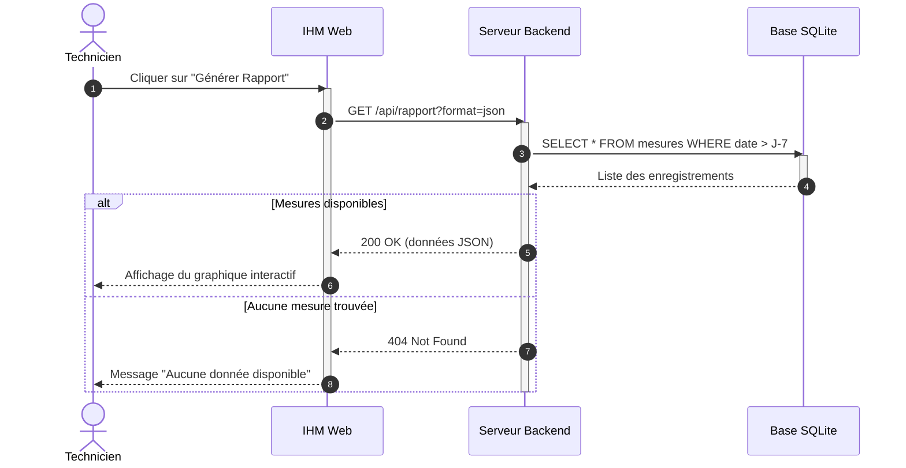

# 📚 Module 04 — Le Diagramme de Séquence

---

## 1. Utilité & Définition

Le diagramme de séquence représente la **dimension temporelle et dynamique** du système.
Il met en scène l'échange chronologique de messages entre **instances d'objets** et **acteurs externes** pour réaliser un scénario précis issu d'un cas d'utilisation.

En BTS CIEL, il est indispensable pour modéliser :
- Les **protocoles réseaux** (MQTT, HTTP REST, CoAP, Modbus TCP, WebSockets).
- Les **dialogues inter-processus** et bus matériels (SPI, I2C, UART).
- Les séquences d'initialisation et de traitement d'erreurs.

---

## 2. Éléments Clés d'un Diagramme de Séquence

### Fragments Combinés Majeurs :
- `alt` : **Alternative :** Exécute un bloc parmi plusieurs selon une condition (`if ... else`).
- `opt` : **Optionnel :** Exécute un bloc si la condition est vraie, rien sinon (`if` sans `else`).
- `loop` : **Boucle :** Répète le bloc tant qu'une condition est vérifiée (`for`, `while`).
- `par` : **Parallélisme :** Exécute plusieurs branches simultanément (threads, multitâche).
