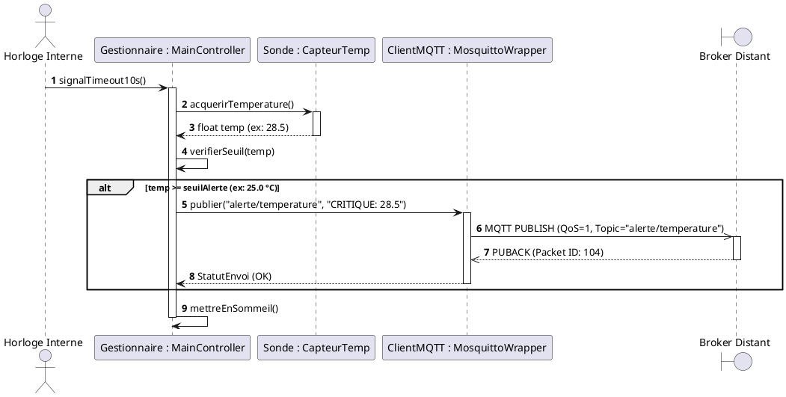

# 📚 Module 04 — Le Diagramme de Séquence

---

## 1. Utilité & Définition

Le diagramme de séquence représente la **dimension temporelle et dynamique** du système.
Il met en scène l'échange chronologique de messages entre **instances d'objets** et **acteurs externes** pour réaliser un scénario précis issu d'un cas d'utilisation.

En BTS CIEL, il est indispensable pour modéliser :
- Les **protocoles réseaux** (MQTT, HTTP REST, CoAP, Modbus TCP, WebSockets).
- Les **dialogues inter-processus** et bus matériels (SPI, I2C, UART).
- Les séquences d'initialisation et de traitement d'erreurs.

---

## 2. Éléments Clés d'un Diagramme de Séquence

### Fragments Combinés Majeurs :
- `alt` : **Alternative :** Exécute un bloc parmi plusieurs selon une condition (`if ... else`).
- `opt` : **Optionnel :** Exécute un bloc si la condition est vraie, rien sinon (`if` sans `else`).
- `loop` : **Boucle :** Répète le bloc tant qu'une condition est vérifiée (`for`, `while`).
- `par` : **Parallélisme :** Exécute plusieurs branches simultanément (threads, multitâche).

---

## 3. Exemple Concret BTS CIEL : Publication MQTT Sécurisée

### Scénario :
Une sonde connectée acquiert la température, vérifie si elle franchit un seuil critique, et publie la donnée sur un broker MQTT distant.

---

## 4. Conseils pour la Rédaction en BTS CIEL
- **Nommez précisément les instances :** `nomInstance : NomClasse` (ex: `sondeTemp : Capteur`).
- **N'oubliez pas les retours :** Les flèches pointillées `-->` matérialisent le résultat renvoyé à l'appelant.
- **Distinguez synchrone et asynchrone :** Flèche pleine `->` pour un appel de fonction bloquant, flèche ouverte `->>` pour un paquet réseau (UDP/MQTT).

---

| ⬅️ Précédent | 🏠 Accueil | ➡️ Chapitre Suivant |
| :--- | :---: | ---: |
| [**Chapitre 03 : Diagramme de Classes**](../03-diagramme-classes/) | [**Sommaire du Dépôt**](../../README.md) | [**Chapitre 05 : Passage UML vers Code ➔**](../05-passage-uml-vers-code/) |

 

**🚀 Que souhaitez-vous faire ensuite ?**

[<kbd> &nbsp; 🛠️ Mettre en pratique : TP 3 — Supervision & Protocoles MQTT ➔ &nbsp; </kbd>](../../tp-exercices/tp3-sequence-supervision-mqtt/)
&nbsp;&nbsp;&nbsp;
[<kbd> &nbsp; ➡️ Continuer le cours : Chapitre 05 — Passage UML vers Code ➔ &nbsp; </kbd>](../05-passage-uml-vers-code/)

