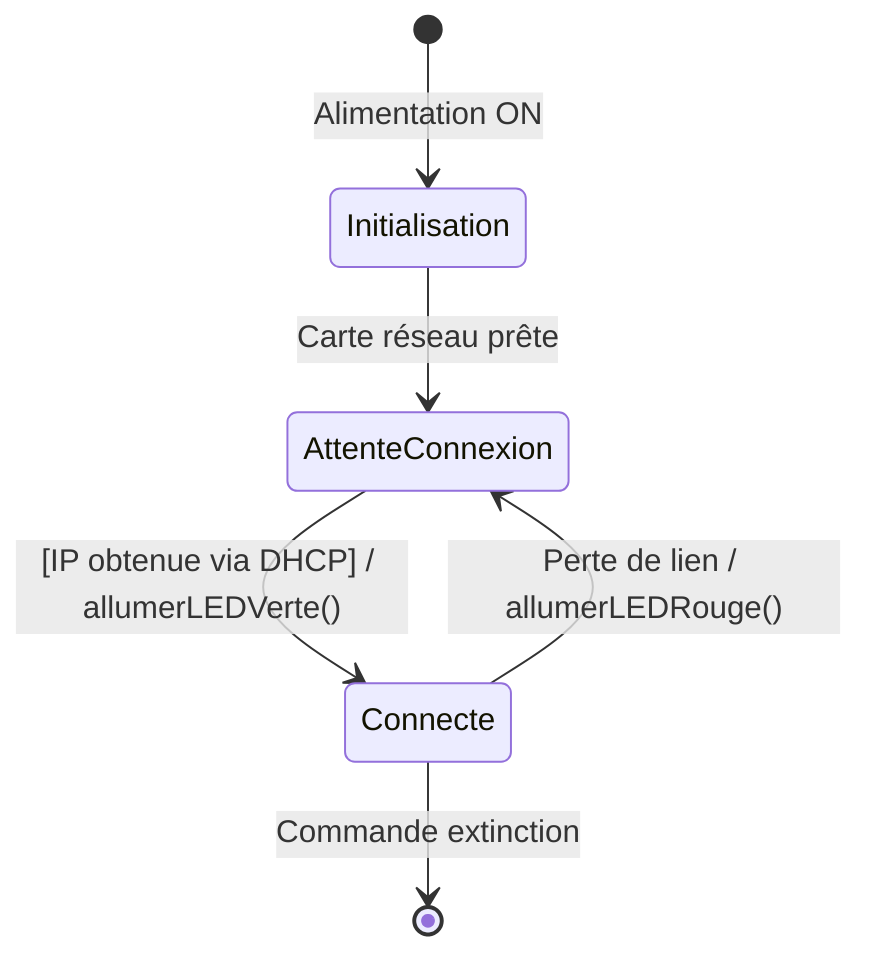

# 📚 Module 05 — Le Diagramme d'États-Transitions (State Machine)

---

## 1. Pourquoi est-il capital en BTS CIEL ?

En informatique industrielle, en électronique connectée et en réseaux, la plupart des systèmes sont **réactifs** : ils passent leur temps à attendre des événements (appui sur un bouton, réception d'un paquet réseau, expiration d'un timer) pour évoluer d'un mode de fonctionnement à un autre.

Le diagramme d'états-transitions modélise le cycle de vie complet d'un objet sous la forme d'un **automate à états finis (FSM - *Finite State Machine*)**.

---

## 2. Définitions & Notations

### Syntaxe d'une transition :
$$\text{Événement} \; [\text{Garde}] \; / \; \text{Action}$$

- **Événement :** Déclencheur externe (ex: `trame_recue(t)`, `bouton_clique`, `timeout_5s`).
- **Garde `[bool]` :** Condition nécessaire pour autoriser le franchissement (ex: `[nbTentatives < 3]`).
- **Action `/ ...` :** Effet de bord produit lors du passage (ex: `/ envoyerAck()`, `/ resetCompteur()`).
