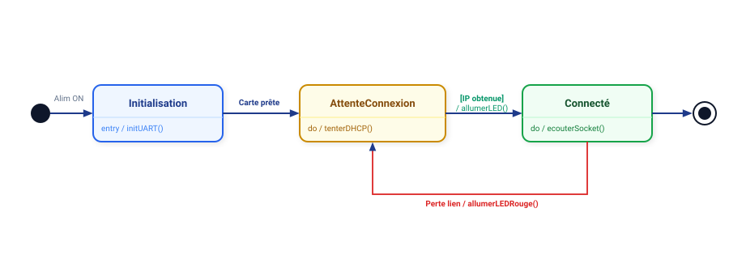

# 📚 Module 05 — Le Diagramme d'États-Transitions (State Machine)

---

## 1. Pourquoi est-il capital en BTS CIEL ?

En informatique industrielle, en électronique connectée et en réseaux, la plupart des systèmes sont **réactifs** : ils passent leur temps à attendre des événements (appui sur un bouton, réception d'un paquet réseau, expiration d'un timer) pour évoluer d'un mode de fonctionnement à un autre.

Le diagramme d'états-transitions modélise le cycle de vie complet d'un objet sous la forme d'un **automate à états finis (FSM - *Finite State Machine*)**.

---

## 2. Définitions & Notations



### Syntaxe d'une transition :
$$\text{Événement} \; [\text{Garde}] \; / \; \text{Action}$$

- **Événement :** Déclencheur externe (ex: `trame_recue(t)`, `bouton_clique`, `timeout_5s`).
- **Garde `[bool]` :** Condition nécessaire pour autoriser le franchissement (ex: `[nbTentatives < 3]`).
- **Action `/ ...` :** Effet de bord produit lors du passage (ex: `/ envoyerAck()`, `/ resetCompteur()`).

---

## 3. Exemple Concret BTS CIEL : Automate d'un Modem Connecté 4G / WiFi

```plantuml
@startuml
skinparam state {
    BackgroundColor #F0FDF4
    BorderColor #15803D
}

[*] --> Veille : Mise sous tension

state Veille {
    entry / desactiverModem()
    entry / armerTimerReveil(300s)
}

state ConnexionReseau {
    entry / alimenterModem()
    do / tenterAssociationAP()
}

state EnvoiMesures {
    entry / ouvrirSocketTCP()
    do / transmettrePayload()
}

state GestionErreur {
    entry / incrementerCompteurEchec()
    entry / allumerLEDRouge()
}

Veille --> ConnexionReseau : TimerExpire
Veille --> ConnexionReseau : BoutonForceAppuye

ConnexionReseau --> EnvoiMesures : AssociationReussie [SignalRSSI > -85dBm]
ConnexionReseau --> GestionErreur : AssociationEchouee / journaliserErreur()
ConnexionReseau --> GestionErreur : after(30s) / timeout()

EnvoiMesures --> Veille : AckServeurRecu / resetCompteurEchec()
EnvoiMesures --> GestionErreur : ErreurEmission

GestionErreur --> ConnexionReseau : [nbTentatives < 3] / attendre(5s)
GestionErreur --> Veille : [nbTentatives >= 3] / alerteSauvegardeLocale()

Veille --> [*] : CommandeArretSysteme
@enduml
```

---

## 4. Implémentation en C++ et Python (Machine d'États)

### Exemple en C++ (Enum Class & Switch-Case) :
```cpp
enum class Etat {
    VEILLE,
    CONNEXION_RESEAU,
    ENVOI_MESURES,
    GESTION_ERREUR
};

void traiterEvenement(Evenement evt) {
    switch (m_etatCourant) {
        case Etat::VEILLE:
            if (evt == Evenement::TIMER_EXPIRE) {
                m_etatCourant = Etat::CONNEXION_RESEAU;
                tenterConnexion();
            }
            break;
        case Etat::CONNEXION_RESEAU:
            if (evt == Evenement::CONNEXION_OK) {
                m_etatCourant = Etat::ENVOI_MESURES;
                transmettre();
            } else if (evt == Evenement::TIMEOUT) {
                m_etatCourant = Etat::GESTION_ERREUR;
            }
            break;
        // ...
    }
}
```
