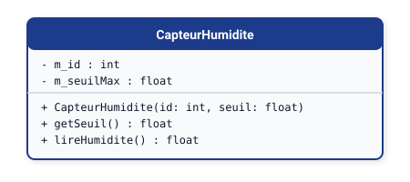

# 📚 Module 05 — Passage de la Conception UML au Code (C++ & Python)

---

## 1. Introduction

Une modélisation UML n'a de valeur que si elle se traduit de manière rigoureuse et sans ambiguïté dans le code source de l'application. Ce module fournit le dictionnaire de traduction officiel entre les concepts UML et les langages phares du **BTS CIEL** : **C++** (orienté objet, Qt, systèmes temps réel) et **Python** (scripts réseau, supervision, IA/IoT).

---

## 2. Modélisation d'une Classe Simple

### Diagramme UML :


### Implémentation C++ :
```cpp
// CapteurHumidite.hpp
#pragma once

class CapteurHumidite {
private:
    int m_id;
    float m_seuilMax;

public:
    CapteurHumidite(int id, float seuil);
    float getSeuil() const;
    void setSeuil(float valeur);
    float lireHumidite();
};

// CapteurHumidite.cpp
#include "CapteurHumidite.hpp"

CapteurHumidite::CapteurHumidite(int id, float seuil)
    : m_id(id), m_seuilMax(seuil) {}

float CapteurHumidite::getSeuil() const { return m_seuilMax; }
void CapteurHumidite::setSeuil(float valeur) { m_seuilMax = valeur; }

float CapteurHumidite::lireHumidite() {
    return 65.4f;
}
```

### Implémentation Python :
```python
# capteur_humidite.py

class CapteurHumidite:
    def __init__(self, id_capteur: int, seuil_max: float):
        self._id = id_capteur
        self._seuil_max = seuil_max

    @property
    def seuil(self) -> float:
        return self._seuil_max

    @seuil.setter
    def seuil(self, valeur: float) -> None:
        self._seuil_max = valeur

    def lire_humidite(self) -> float:
        return 65.4
```

---

## 3. Traduction des Relations entre Classes

### A. Multiplicité 1 vers 0..* (Collection)
Si une `Passerelle` gère plusieurs `Capteur` :

#### En C++ (STL `std::vector`) :
```cpp
#include <vector>
#include "Capteur.hpp"

class Passerelle {
private:
    std::vector<Capteur*> m_capteurs; // Agrégation : pointeurs externes

public:
    void ajouterCapteur(Capteur* c) {
        if (c != nullptr) {
            m_capteurs.push_back(c);
        }
    }
};
```

#### En Python :
```python
from typing import List
from capteur import Capteur

class Passerelle:
    def __init__(self):
        self._capteurs: List[Capteur] = []

    def ajouter_capteur(self, c: Capteur) -> None:
        if c is not None:
            self._capteurs.append(c)
```

---

### B. Composition vs Agrégation

| Relation | C++ | Python |
| :--- | :--- | :--- |
| **Composition** (`A *-- B`) | L'objet B est alloué en membre direct (`B m_b;`) ou via `std::unique_ptr<B>`. Il naît et meurt avec A. | B est instancié à l'intérieur du constructeur de A : `self._b = B()`. |
| **Agrégation** (`A o-- B`) | Pointeur non possédé (`B* m_b;` ou `std::shared_ptr<B>`). L'objet B est injecté depuis l'extérieur. | B est reçu en paramètre : `def set_b(self, b: B): self._b = b`. |

---

### C. Héritage et Polymorphisme

#### En C++ (Classes Abstraites) :
```cpp
class Capteur {
public:
    virtual ~Capteur() = default;
    virtual float acquerir() = 0; // Méthode virtuelle pure
};

class CapteurTemperature : public Capteur {
public:
    float acquerir() override {
        return 22.5f;
    }
};
```

#### En Python (Module `abc`) :
```python
from abc import ABC, abstractmethod

class Capteur(ABC):
    @abstractmethod
    def acquerir(self) -> float:
        pass

class CapteurTemperature(Capteur):
    def acquerir(self) -> float:
        return 22.5
```

---

<div align="center">

| ⬅️ Précédent | 🏠 Accueil | ➡️ Suite Logique (Grand Projet) |
| :--- | :---: | ---: |
| [**Chapitre 04 : Diagramme de Séquence**](../04-diagramme-sequence/) | [**Sommaire du Dépôt**](../../README.md) | [**TP 4 : Projet de Synthèse (RFID) ➔**](../../tp-exercices/tp4-projet-synthese-controle-acces/) |

<br>

[<kbd> &nbsp; 🚀 Passer au Projet de Synthèse : TP 4 — Contrôle d'Accès RFID &nbsp; </kbd>](../../tp-exercices/tp4-projet-synthese-controle-acces/)

</div>

