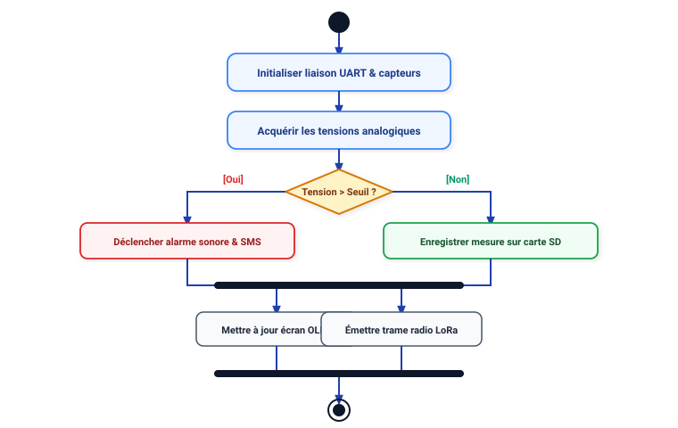
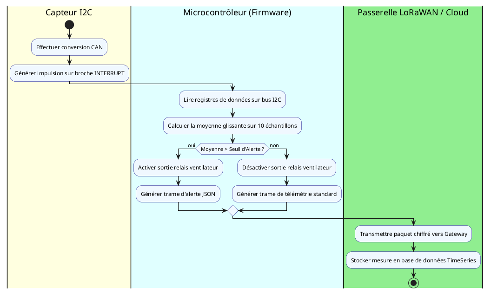

# 📚 Module 06 — Le Diagramme d'Activité

---

## 1. Objectif

Le diagramme d'activité modélise le **déroulement séquentiel et parallèle** d'un algorithme, d'un processus métier ou d'un flux de traitement de données. Il est le successeur moderne et normalisé de l'organigramme technique (*flowchart*).

---

## 2. Nœuds et Notations Clés

---

## 3. Exemple avec Couloirs de Responsabilité (Partitions / Swimlanes)

Dans un système communicant complexe, les couloirs permettent d'attribuer chaque action à une entité matérielle ou logicielle distincte :

---

## 4. Règles d'Or pour le Diagramme d'Activité
- **Fourche (`fork`) vs Décision :** La fourche lance des actions **simultanées** (parallèles), alors que le losange de décision choisit **une seule branche** selon une condition.
- **Toujours synchroniser :** Tout `fork` doit se refermer par un `join` avant la fin du flux.
