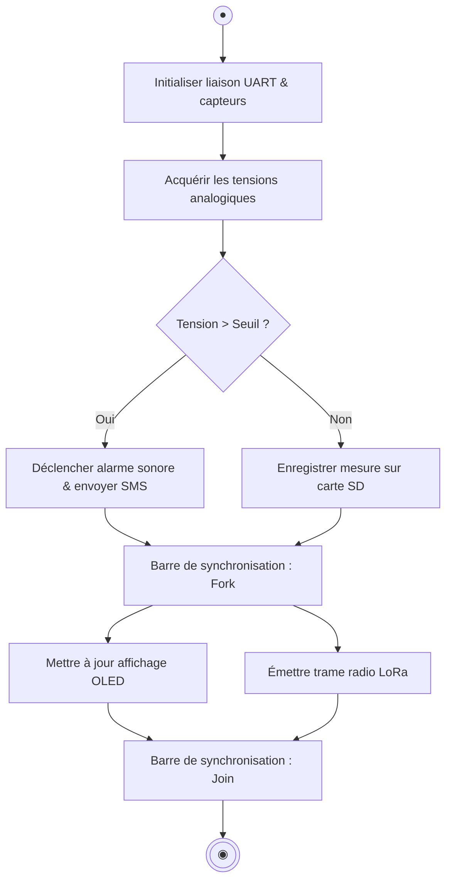

# 📚 Module 06 — Le Diagramme d'Activité

---

## 1. Objectif

Le diagramme d'activité modélise le **déroulement séquentiel et parallèle** d'un algorithme, d'un processus métier ou d'un flux de traitement de données. Il est le successeur moderne et normalisé de l'organigramme technique (*flowchart*).

---

## 2. Nœuds et Notations Clés

