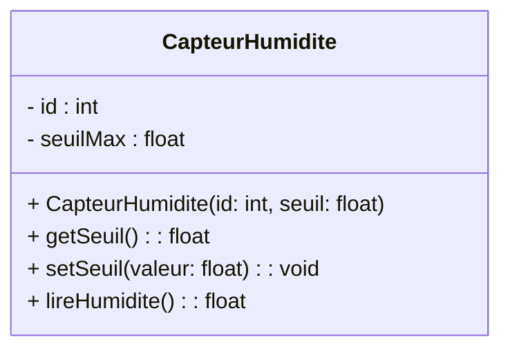

# 📚 Module 07 — Passage de la Conception UML au Code (C++ & Python)

---

## 1. Introduction

Une modélisation UML n'a de valeur que si elle se traduit de manière rigoureuse et sans ambiguïté dans le code source de l'application. Ce module fournit le dictionnaire de traduction officiel entre les concepts UML et les langages phares du **BTS CIEL** : **C++** (orienté objet, Qt, systèmes temps réel) et **Python** (scripts réseau, supervision, IA/IoT).

---

## 2. Modélisation d'une Classe Simple

### Diagramme UML :


### Implémentation C++ :
```cpp
// CapteurHumidite.hpp
#pragma once

class CapteurHumidite {
private:
    int m_id;
    float m_seuilMax;

public:
    CapteurHumidite(int id, float seuil);
    float getSeuil() const;
    void setSeuil(float valeur);
    float lireHumidite();
};

// CapteurHumidite.cpp
#include "CapteurHumidite.hpp"

CapteurHumidite::CapteurHumidite(int id, float seuil)
    : m_id(id), m_seuilMax(seuil) {}

float CapteurHumidite::getSeuil() const { return m_seuilMax; }
void CapteurHumidite::setSeuil(float valeur) { m_seuilMax = valeur; }

float CapteurHumidite::lireHumidite() {
    return 65.4f;
}
```

### Implémentation Python :
```python
# capteur_humidite.py

class CapteurHumidite:
    def __init__(self, id_capteur: int, seuil_max: float):
        self._id = id_capteur
        self._seuil_max = seuil_max

    @property
    def seuil(self) -> float:
        return self._seuil_max

    @seuil.setter
    def seuil(self, valeur: float) -> None:
        self._seuil_max = valeur

    def lire_humidite(self) -> float:
        return 65.4
```
