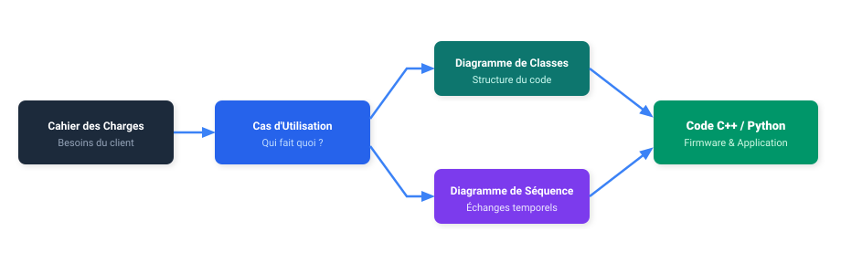

# 📖 Mémento UML 2.5 (Cheatsheet BTS CIEL)

Ce mémento rassemble les règles indispensables pour maîtriser les **3 diagrammes clés** du BTS CIEL.

---

## 1. Vue d'ensemble du Cycle de Modélisation

---

## 2. Diagramme des Cas d'Utilisation (Use Case)

### Éléments fondamentaux
- **Acteur :** Entité externe (humain, système tiers, composant matériel autonome, timer) interagissant avec le système.
- **Cas d'utilisation :** Ensemble d'actions produisant un résultat observable pour un acteur (nommé avec un verbe à l'infinitif).
- **Frontière :** Rectangle délimitant le système analysé du monde extérieur.

### Relations
| Relation | Symbole | Signification |
| :--- | :---: | :--- |
| **Association** | `───` | L'acteur participe au cas d'utilisation |
| **Inclusion** | `-.-> <<include>>` | Le cas de base **inclut obligatoirement** le sous-cas (systématique) |
| **Extension** | `-.-> <<extend>>` | Le cas étendu s'exécute **optionnellement** selon une condition |
| **Généralisation** | `──▷` | Héritage de rôle entre acteurs ou spécialisation de cas |

---

## 3. Diagramme de Classes

### Visibilité des Membres
| Symbole | Visibilité | Portée |
| :---: | :--- | :--- |
| `+` | **Public** | Accessible depuis tout le code |
| `-` | **Private** | Accessible uniquement dans la classe (encapsulation) |
| `#` | **Protected** | Accessible par la classe et ses classes dérivées |

### Les 3 Relations Clés

| Relation | Symbole PlantUML | Signification | Traduction en Code |
| :--- | :---: | :--- | :--- |
| **Héritage** | `<\|--` | « Est un » (généralisation / polymorphisme) | `class B : public A` / `class B(A):` |
| **Agrégation** | `o--` | Contenant / contenu faible (cycles de vie indépendants) | `Capteur*` en paramètre |
| **Composition** | `*--` | Contenant / contenu fort (cycle de vie lié) | Objet membre direct ou `unique_ptr` |

---

## 4. Diagramme de Séquence

### Messages & Chronologie
- `->` : **Message synchrone** (bloquant, appel de fonction classique).
- `->>` : **Message asynchrone** (non bloquant, paquet réseau UDP/MQTT).
- `-->` : **Réponse / Retour** (pointillés, renvoi d'une valeur).

### Fragments Combinés
- `alt ... else ... end` : Alternative conditionnelle (`if ... else`).
- `opt ... end` : Traitement optionnel (`if` sans `else`).
- `loop ... end` : Répétition (`for`, `while`).
