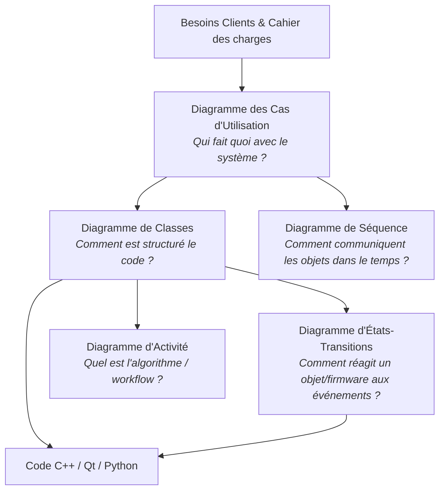
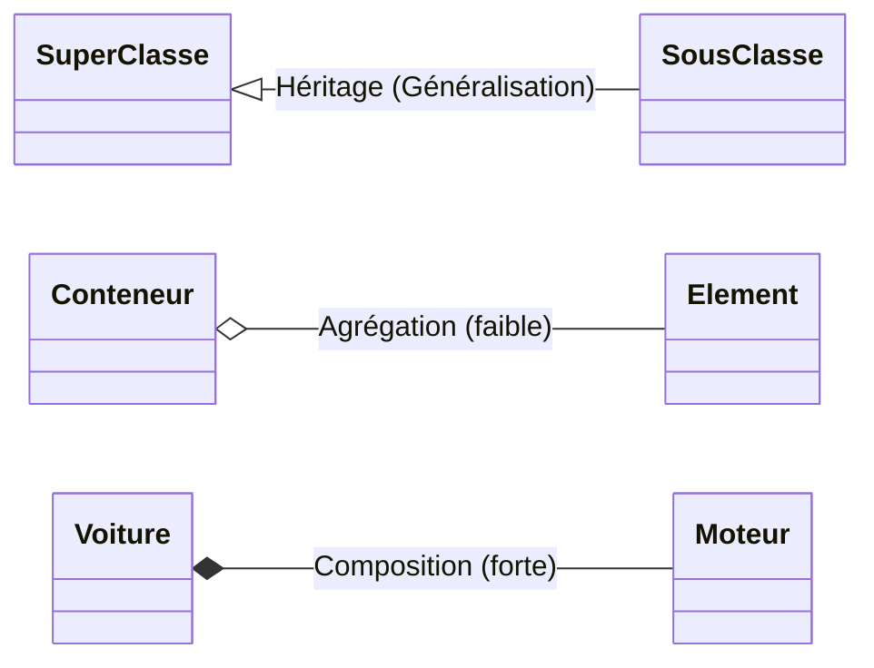

# 📖 Mémento UML 2.5 (Cheatsheet BTS CIEL)

Ce mémento rassemble les règles fondamentales, les symboles normalisés et les astuces de modélisation pour réussir vos épreuves de BTS CIEL (E5 et projet E6).

---

## 1. Vue d'ensemble des 5 Diagrammes Clés en BTS CIEL

---

## 2. Diagramme des Cas d'Utilisation (Use Case)

### Éléments fondamentaux
- **Acteur :** Entité externe (humain, système tiers, composant matériel autonome, timer) interagissant avec le système.
- **Cas d'utilisation :** Ensemble d'actions réalisées par le système pour produire un résultat observable pour un acteur.
- **Frontière :** Rectangle délimitant le système analysé du monde extérieur.

### Relations
| Relation | Symbole | Signification | Règle d'or |
| :--- | :---: | :--- | :--- |
| **Association** | `───` | L'acteur participe au cas d'utilisation | Pas de flèche sauf cas particulier |
| **Inclusion** | `-.-> <<include>>` | Le cas A **inclut obligatoirement** le cas B | Exécution systématique (ex : s'authentifier) |
| **Extension** | `-.-> <<extend>>` | Le cas B **étend optionnellement** le cas A | Déclenché sous condition / point d'extension |
| **Généralisation** | `──▷` | Héritage de rôle ou spécialisation d'un cas | Un *Administrateur* hérite d'un *Utilisateur* |

---

## 3. Diagramme de Classes

### Visibilité des Membres
| Symbole | Visibilité | Portée |
| :---: | :--- | :--- |
| `+` | **Public** | Accessible depuis n'importe quel code externe |
| `-` | **Private** | Accessible uniquement depuis la classe elle-même (encapsulation) |
| `#` | **Protected** | Accessible par la classe et ses classes dérivées (héritage) |
| `~` | **Package** | Accessible au sein du même package / module |

### Multiplicités / Cardinalités Courantes
- `1` : Exactement un
- `0..1` : Zéro ou un (optionnel / pointeur pouvant être nul)
- `*` ou `0..*` : Zéro à plusieurs (collection, tableau dynamique, `std::vector`)
- `1..*` : Au moins un à plusieurs

### Relations entre Classes

| Type de Relation | Notation PlantUML | Description & Règle Métier | Traduction en Code |
| :--- | :---: | :--- | :--- |
| **Association** | `A --> B` | A connaît B, pas de lien de possession vital | Pointeur ou référence simple |
| **Agrégation** | `A o-- B` | Le "tout" possède la "partie", mais la partie survit sans le tout | Pointeur passé en paramètre |
| **Composition** | `A *-- B` | Le "tout" possède exclusivement la "partie" ; si A meurt, B meurt | Objet membre direct ou allocation exclusive |
| **Héritage** | `A <|-- B` | B est un cas particulier de A ("est un") | `class B : public A` en C++ |
| **Dépendance** | `A ..> B` | A utilise temporairement B (paramètre ou variable locale) | Paramètre de méthode éphémère |

---

## 4. Diagramme de Séquence

### Types de Messages
- **Synchrone :** Flèche pleine `->` (l'émetteur attend la fin de l'exécution).
- **Asynchrone :** Flèche ouverte `->>` (l'émetteur envoie et continue sans attendre).
- **Réponse :** Flèche pointillée `-->` (valeur renvoyée à la fin d'un appel).

### Fragments Combinés Essentiels
- `alt` : Alternative conditionnelle (`if ... else`).
- `opt` : Optionnel (`if` sans `else`).
- `loop` : Répétition (`for`, `while`).
- `par` : Traitements parallèles (threads, multitâche).

---

## 5. Diagramme d'États-Transitions

### Syntaxe normalisée d'une transition :
$$\text{Événement} \; [\text{Condition de Garde}] \; / \; \text{Action}$$

- **Événement :** Ce qui déclenche la transition (ex: `bouton_appuye`, `trame_recue`, `after(5s)`).
- **Garde :** Condition booléenne indispensable pour franchir la transition (ex: `[batterie > 20%]`).
- **Action :** Opération brève exécutée lors du franchissement (ex: `/ allumerLED()`).

### Actions d'un État :
- `entry /` : action exécutée dès l'entrée dans l'état.
- `do /` : activité continue exécutée tant que l'on reste dans l'état.
- `exit /` : action exécutée juste avant de quitter l'état.
