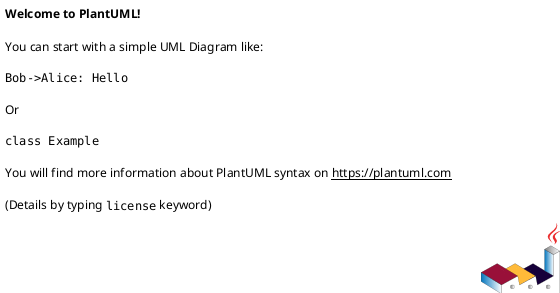
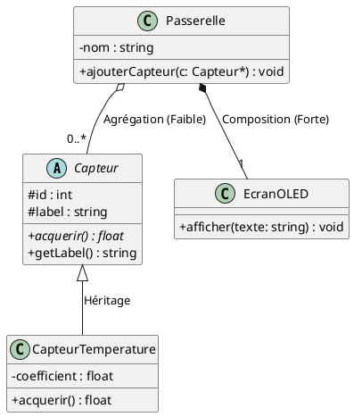
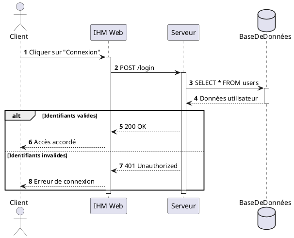

# 🛠️ Tutoriel & Guide de Lancement PlantUML (Les 3 Diagrammes Clés)

PlantUML utilise l'approche **« Diagram as Code »** : vous décrivez vos diagrammes en texte simple dans un fichier `.puml`, et l'outil génère le schéma graphique automatiquement.

---

## 1. 🚀 Comment Lancer et Prévisualiser un Diagramme ?

### Méthode 1 : Dans VS Code (Recommandé en TP)

1. **Ouvrez le fichier `.puml`** de votre choix (ex: `borne_irve.puml`).
2. **Lancez la prévisualisation graphique :**
   - **Raccourci clavier principal :** pressez simultanément **`Alt + D`** (ou `Option + D` sur macOS).
   - *Alternative par clic droit :* faites un clic droit n'importe où dans le code du fichier `.puml` $\rightarrow$ cliquez sur **« Preview Diagram »** (ou **« PlantUML: Preview Current Diagram »**).
   - *Alternative palette de commandes :* ouvrez la palette (`Ctrl + Shift + P`) $\rightarrow$ tapez `PlantUML: Preview Current Diagram` $\rightarrow$ appuyez sur **Entrée**.
3. **Rendu interactif en temps réel :**
   - Un panneau latéral s'ouvre avec le schéma calculé.
   - Dès que vous modifiez le code et sauvegardez (`Ctrl + S`), le schéma se met automatiquement à jour !
4. **Exporter le schéma en image (pour votre compte-rendu) :**
   - Pressez `Ctrl + Shift + P` $\rightarrow$ tapez `PlantUML: Export Current Diagram`.
   - Choisissez le format : **PNG** (image standard) ou **SVG** (image vectorielle nette à tout zoom). L'image sera générée dans un sous-dossier `out/`.

> 💡 **Astuce Anti-Blocage : Si vous avez une erreur « Graphviz / Java not found » :**  
> Si Java ou Graphviz n'est pas installé sur le poste du lycée, activez le mode serveur distant en 15 secondes :  
> 1. Ouvrez les paramètres de VS Code (`Ctrl + ,`).  
> 2. Tapez `plantuml.server` dans la barre de recherche en haut.  
> 3. Renseignez l'adresse : `https://www.plantuml.com/plantuml`  
> 4. Cherchez le paramètre `plantuml.render` et passez-le de `Local` à `PlantUMLServer`.  
> Le raccourci `Alt + D` fonctionnera immédiatement, sans rien installer d'autre !

---

### Méthode 2 : Sans rien installer (100% dans le Navigateur Web)

Si vous n'êtes pas sur votre PC de TP ou travaillez depuis une tablette :

1. **Sur l'éditeur officiel PlantText :**  
   - Ouvrez : 👉 [https://www.planttext.com/](https://www.planttext.com/) ou [https://www.plantuml.com/plantuml/uml](https://www.plantuml.com/plantuml/uml)
   - Copiez-collez votre code `.puml` dans la zone de texte à gauche.
   - Le diagramme s'affiche instantanément à droite avec des boutons de téléchargement en **PNG** ou **SVG**.
2. **Depuis GitHub Web (touche `.`) :**  
   - Sur la page GitHub du dépôt, appuyez simplement sur la touche clavier **`.`** (point) pour ouvrir l'éditeur VS Code Web dans votre navigateur.

---

### Méthode 3 : En Ligne de Commande (CLI Java)

Si vous préférez compiler vos diagrammes depuis un script ou un terminal :
```bash
# Générer un rendu PNG
java -jar plantuml.jar mon_diagramme.puml

# Générer un rendu vectoriel SVG
java -jar plantuml.jar -tsvg mon_diagramme.puml
```

---

## 2. La Règle d'Or de la Syntaxe

Tout bloc PlantUML commence impérativement par `@startuml` et se termine par `@enduml`.  
Les commentaires commencent par une simple apostrophe `'` (tout ce qui suit sur la ligne est ignoré).



---

## 3. Diagramme des Cas d'Utilisation (Use Case)


```plantuml
@startuml
left to right direction

actor "Conducteur" as user
actor "Technicien" as tech
actor "Serveur Cloud" as cloud <<Système externe>>

tech --|> user ' Héritage entre acteurs

rectangle "Système : Borne de Recharge" {
    usecase "Recharger véhicule" as UC_Charge
    usecase "S'authentifier" as UC_Auth
    usecase "Recevoir un reçu" as UC_Recu
}

user --> UC_Charge
UC_Charge ..> UC_Auth : <<include>>
UC_Charge <.. UC_Recu : <<extend>>
UC_Charge --> cloud
@enduml
```

---

## 4. Diagramme de Classes



---

## 5. Diagramme de Séquence



---

<div align="center">

| ⬅️ Précédent | 🏠 Accueil | ➡️ Suite |
| :--- | :---: | ---: |
| [**Mémento UML CIEL**](cheatsheet-uml-ciel.md) | [**Sommaire Général**](../README.md) | [**Guide Outillage VS Code ➔**](guide-outillage-vscode.md) |

<br>

[<kbd> &nbsp; ➡️ Configurer l'environnement : Guide VS Code &nbsp; </kbd>](guide-outillage-vscode.md)

</div>

