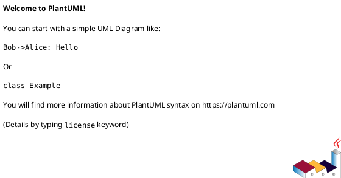
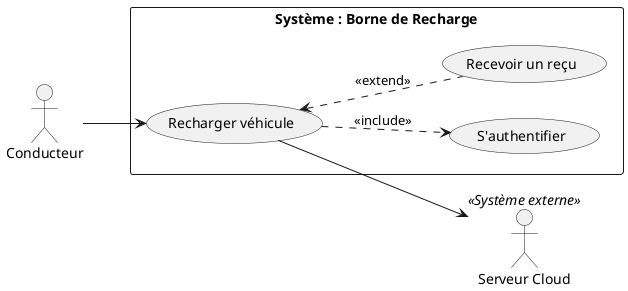
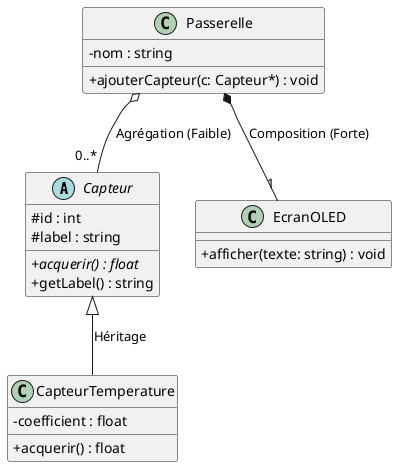
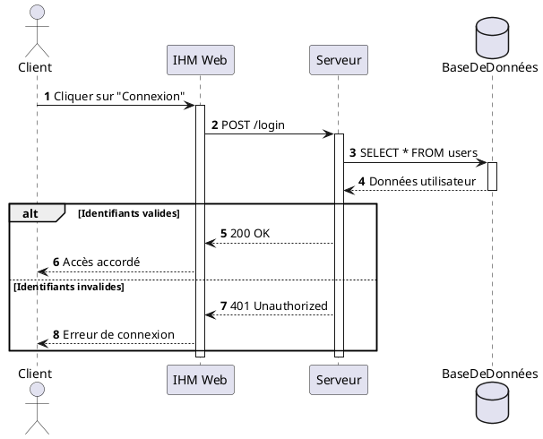

# 🛠️ Tutoriel Rapide : Syntaxe du Code PlantUML

PlantUML utilise l'approche **« Diagram as Code »** : vous décrivez vos diagrammes sous forme de texte simple, et l'outil génère le schéma graphique automatiquement.

---

## 1. La Règle d'Or

Tout bloc ou fichier PlantUML commence impérativement par `@startuml` et se termine par `@enduml`.  
Les commentaires débutent par une simple apostrophe `'`.



---

## 2. Cas d'Utilisation (Use Case)



### Règles clés :
- `actor "Nom" as Alias` : déclare un acteur.
- `usecase "Nom" as Alias` : déclare une bulle de cas d'utilisation.
- `rectangle "Nom" { ... }` : délimite le périmètre du système.
- `A ..> B : <<include>>` : inclusion (B est obligatoire).
- `B <.. A : <<extend>>` : extension (A est optionnel).

### Héritage (Généralisation) en Use Case :
PlantUML utilise la flèche `--|>` (triangle vide) pour matérialiser l'héritage :

```plantuml
' 1. Héritage entre Acteurs (Admin hérite de Utilisateur)
Technicien --|> Utilisateur

' 2. Héritage entre Cas (Spécialisation d'un besoin générique)
(Payer par CB) --|> (Régler la commande)
(Payer par RFID) --|> (Régler la commande)
```


---

## 3. Diagramme de Classes



### Symboles de Visibilité :
- `-` : **Privé** (`private`)
- `+` : **Public** (`public`)
- `#` : **Protégé** (`protected`)

### Flèches de Relations :
- `<|--` : **Héritage** (triangle vide)
- `o--` : **Agrégation** (losange vide)
- `*--` : **Composition** (losange plein noir)
- `-->` : **Association navigable**

---

## 4. Diagramme de Séquence



### Règles clés :
- `autonumber` : numérote automatiquement chaque échange.
- `->` : appel de méthode synchrone (flèche pleine).
- `-->` : valeur de retour (flèche pointillée).
- `activate / deactivate` : barres d'exécution.
- `alt ... else ... end` : branchement conditionnel `if ... else`.

---

## 5. Diagramme d'États-Transitions

```plantuml
@startuml
[*] --> Veille : Mise sous tension

state Veille {
    entry / eteindreLEDs()
}

state Connecte {
    do / emettreTrames()
}

Veille --> Connecte : BoutonAppuye / allumerLED()
Connecte --> Veille : after(10s) / timeout()
Connecte --> [*] : CommandeArret
@enduml
```

### Syntaxe d'une transition :
$$\text{EtatSource} \rightarrow \text{EtatCible} : \text{Événement } [\text{Garde}] \; / \; \text{Action}$$

- `entry /` : action d'entrée.
- `exit /` : action de sortie.
- `do /` : traitement en continu.
- `[*]` : état initial ou final.
