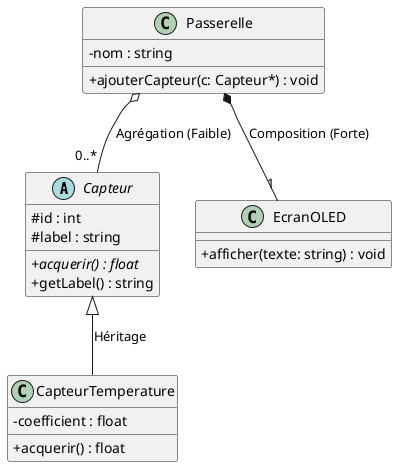
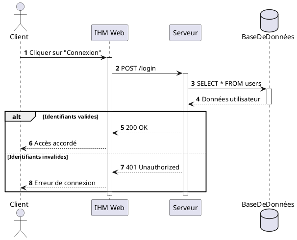

# 🛠️ Tutoriel Rapide : Syntaxe PlantUML (Les 3 Diagrammes Clés)

PlantUML utilise l'approche **« Diagram as Code »** : vous décrivez vos diagrammes en texte simple, et l'outil génère le schéma graphique automatiquement (`Alt + D`).

---

## 1. La Règle d'Or
Tout bloc PlantUML commence par `@startuml` et se termine par `@enduml`.  
Les commentaires commencent par une simple apostrophe `'`.

---

## 2. Diagramme des Cas d'Utilisation (Use Case)

```plantuml
@startuml
left to right direction

actor "Conducteur" as user
actor "Technicien" as tech
actor "Serveur Cloud" as cloud <<Système externe>>

tech --|> user ' Héritage entre acteurs

rectangle "Système : Borne de Recharge" {
    usecase "Recharger véhicule" as UC_Charge
    usecase "S'authentifier" as UC_Auth
    usecase "Recevoir un reçu" as UC_Recu
}

user --> UC_Charge
UC_Charge ..> UC_Auth : <<include>>
UC_Charge <.. UC_Recu : <<extend>>
UC_Charge --> cloud
@enduml
```

---

## 3. Diagramme de Classes



---

## 4. Diagramme de Séquence


